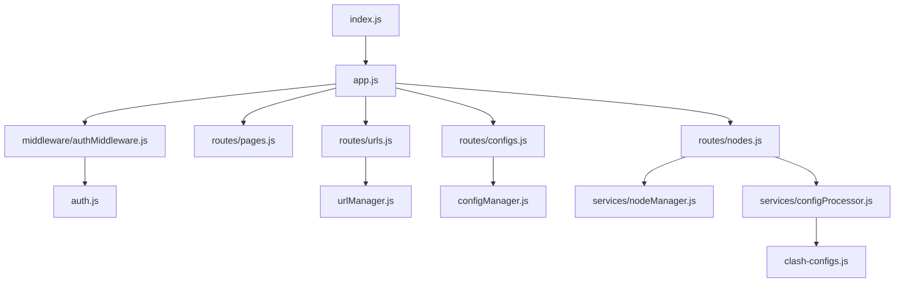

# 项目结构优化计划 - 将 server.js 功能拆分

## 目标

将 `src/server.js` 中耦合的功能进行拆分，按照职责划分到不同的模块中，提高代码的可维护性、可读性和可扩展性。同时增加节点选择和配置管理功能。

## 当前问题

1. `src/server.js` 文件承担了 Web 服务器设置、路由处理、认证逻辑、URL 管理、配置文件管理和配置更新等多种功能，导致代码臃肿，不利于后续的开发和维护。
2. 缺少配置文件格式检查和节点管理功能。
3. 缺少选择性导出配置的功能。
4. 配置文件处理和展示不够直观。

## 优化方案

将 `src/server.js` 中的功能拆分到以下模块中：

### 1. 基础架构模块
1.  **核心应用 (`src/app.js`)**: 负责 Express 应用初始化、中间件配置和服务器启动。
2.  **认证模块 (`src/auth.js`)**: 处理认证配置、IP 授权管理和认证尝试次数限制。
3.  **认证中间件 (`src/middleware/authMiddleware.js`)**: 实现 IP 认证逻辑。

### 2. 功能模块
1. **节点管理模块 (`src/services/nodeManager.js`)**:
```javascript
class NodeManager {
    constructor() {
        this.nodes = new Map(); // 存储节点信息
        this.selectedNodes = new Set(); // 存储选中的节点
    }

    // 解析配置文件中的节点信息
    async parseNodes(config) {
        // 解析proxies部分
        // 提取节点信息：名称、类型、服务器、端口等
        // 返回格式化的节点列表
    }

    // 获取节点列表
    getNodes() {
        return Array.from(this.nodes.values());
    }

    // 选择/取消选择节点
    toggleNode(nodeName) {
        if (this.selectedNodes.has(nodeName)) {
            this.selectedNodes.delete(nodeName);
        } else {
            this.selectedNodes.add(nodeName);
        }
    }

    // 获取选中的节点
    getSelectedNodes() {
        return Array.from(this.selectedNodes);
    }
}
```

2. **配置处理模块 (`src/services/configProcessor.js`)**:
```javascript
class ConfigProcessor {
    constructor(nodeManager) {
        this.nodeManager = nodeManager;
    }

    // 生成基础配置
    async generateBaseConfig() {
        // 读取基础规则
        // 返回不包含节点的基础配置
    }

    // 生成选中节点的配置
    async generateSelectedConfig() {
        const selectedNodes = this.nodeManager.getSelectedNodes();
        // 合并基础配置和选中的节点
        // 返回完整的配置
    }

    // 处理选中节点的配置
    async processSelectedConfig() {
        const config = await this.generateSelectedConfig();
        // 使用clash-configs.js处理配置
        // 返回处理后的配置
    }
}
```

### 3. 路由模块
新增以下路由文件：

1. **节点管理路由 (`src/routes/nodes.js`)**:
```javascript
const express = require('express');
const router = express.Router();

// 获取所有节点列表
router.get('/api/nodes', async (req, res) => {
    const nodes = nodeManager.getNodes();
    res.json(nodes);
});

// 获取选中的节点
router.get('/api/nodes/selected', async (req, res) => {
    const selectedNodes = nodeManager.getSelectedNodes();
    res.json(selectedNodes);
});

// 更新节点选择状态
router.post('/api/nodes/select', async (req, res) => {
    const { nodeName, selected } = req.body;
    nodeManager.toggleNode(nodeName);
    res.json({ success: true });
});

// 获取选中节点的配置
router.get('/selected-config', async (req, res) => {
    const config = await configProcessor.generateSelectedConfig();
    res.setHeader('Content-Type', 'text/yaml');
    res.send(config);
});

// 获取处理后的选中节点配置
router.get('/processed-selected-config', async (req, res) => {
    const config = await configProcessor.processSelectedConfig();
    res.setHeader('Content-Type', 'text/yaml');
    res.send(config);
});
```

### 4. 前端界面

1. **节点管理页面 (`public/nodes.html`)**:
```html
<!DOCTYPE html>
<html>
<head>
    <title>节点管理</title>
    <link rel="stylesheet" href="/css/nodes.css">
</head>
<body>
    <div class="container">
        <!-- 节点列表表格 -->
        <table id="nodeTable">
            <thead>
                <tr>
                    <th>选择</th>
                    <th>名称</th>
                    <th>类型</th>
                    <th>服务器</th>
                    <th>端口</th>
                    <th>操作</th>
                </tr>
            </thead>
            <tbody id="nodeList"></tbody>
        </table>
        
        <!-- 批量操作按钮 -->
        <div class="actions">
            <button onclick="downloadSelectedConfig()">下载选中节点配置</button>
            <button onclick="downloadProcessedConfig()">下载处理后配置</button>
        </div>
    </div>
    <script src="/js/nodeManager.js"></script>
</body>
</html>
```

2. **节点管理脚本 (`public/js/nodeManager.js`)**:
```javascript
// 加载节点列表
async function loadNodes() {
    const response = await fetch('/api/nodes');
    const nodes = await response.json();
    displayNodes(nodes);
}

// 显示节点列表
function displayNodes(nodes) {
    const nodeList = document.getElementById('nodeList');
    nodeList.innerHTML = nodes.map(node => `
        <tr>
            <td>
                <input type="checkbox" 
                       onchange="toggleNode('${node.name}')"
                       ${node.selected ? 'checked' : ''}>
            </td>
            <td>${node.name}</td>
            <td>${node.type}</td>
            <td>${node.server}</td>
            <td>${node.port}</td>
            <td>
                <button onclick="viewNodeDetails('${node.name}')">
                    查看详情
                </button>
            </td>
        </tr>
    `).join('');
}

// 切换节点选择状态
async function toggleNode(nodeName) {
    await fetch('/api/nodes/select', {
        method: 'POST',
        headers: {
            'Content-Type': 'application/json'
        },
        body: JSON.stringify({ nodeName })
    });
}

// 下载选中节点配置
async function downloadSelectedConfig() {
    window.location.href = '/selected-config';
}

// 下载处理后配置
async function downloadProcessedConfig() {
    window.location.href = '/processed-selected-config';
}
```

3. **节点管理样式 (`public/css/nodes.css`)**:
```css
.container {
    padding: 20px;
}

#nodeTable {
    width: 100%;
    border-collapse: collapse;
    margin-bottom: 20px;
}

#nodeTable th, #nodeTable td {
    padding: 10px;
    border: 1px solid #ddd;
    text-align: left;
}

.actions {
    margin-top: 20px;
}

button {
    padding: 8px 16px;
    margin-right: 10px;
}
```

## 优化后的模块结构示意图



## 执行步骤

1. **创建新的服务模块**
   - 创建 `src/services` 目录
   - 实现 `nodeManager.js`
   - 实现 `configProcessor.js`

2. **创建新的路由模块**
   - 创建 `src/routes/nodes.js`
   - 集成节点管理相关的API路由

3. **创建前端页面**
   - 创建 `public/nodes.html`
   - 创建 `public/js/nodeManager.js`
   - 创建 `public/css/nodes.css`

4. **更新现有模块**
   - 修改 `src/app.js`，集成新的路由
   - 更新导航菜单，添加节点管理入口

5. **测试功能**
   - 测试节点解析功能
   - 测试节点选择功能
   - 测试配置生成功能
   - 测试配置下载功能

## API 接口设计

### 节点管理接口
```
GET /api/nodes           # 获取所有节点列表
GET /api/nodes/selected  # 获取已选中的节点
POST /api/nodes/select   # 更新节点选择状态
GET /selected-config     # 获取选中节点的配置
GET /processed-selected-config  # 获取处理后的选中节点配置
```

## 下一步计划

1. **性能优化**
   - 实现节点缓存机制
   - 优化节点解析过程
   - 添加配置文件变更监控

2. **功能增强**
   - 添加节点分组功能
   - 添加节点搜索过滤
   - 支持配置模板管理

3. **用户体验改进**
   - 添加批量选择功能
   - 添加拖拽排序功能
   - 添加配置预览功能